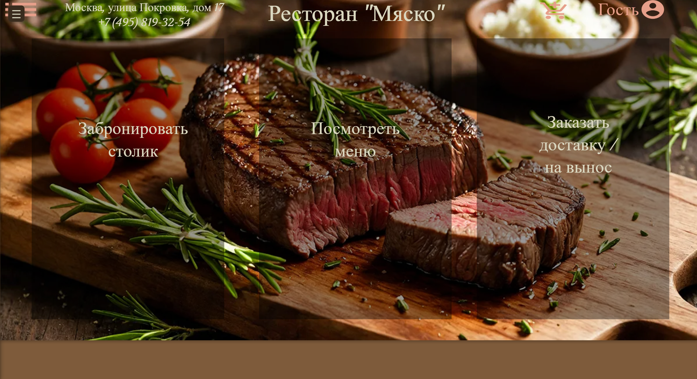
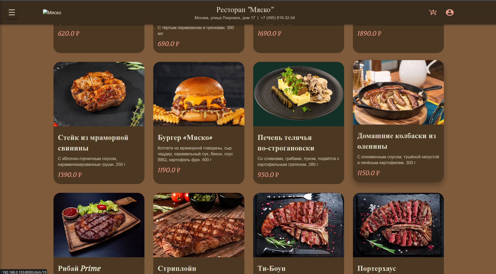
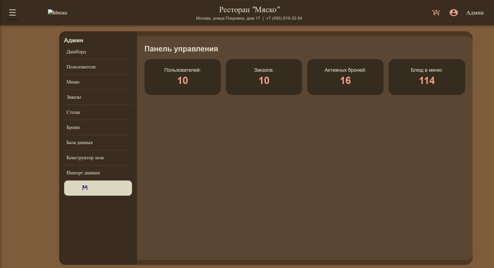
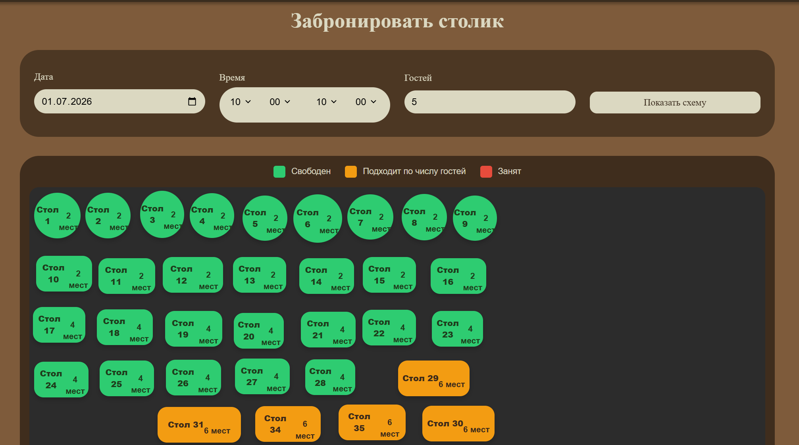

# Flask веб-приложение ресторана — УЧЕБНЫЙ ПРОЕКТ

> **Внимание:** данный проект является **учебным** и разработан в рамках лабораторной работы по дисциплине «Основы веб-разработки». Код не предназначен для использования в коммерческих или промышленных целях и может содержать упрощённые решения и ограничения по безопасности.

Полнофункциональное веб-приложение для управления рестораном: от просмотра меню и бронирования столиков до оформления заказов и администрирования.

**Демо** (локальный запуск): `http://localhost:8000`

---

## Возможности

### Для посетителей
- **Просмотр меню** с фильтрацией по категориям
- **Детальная страница блюда** — описание, цена, аллергены, отзывы и рейтинг
- **Корзина** с выбором способа получения (самовывоз / доставка)
- **Оформление заказа** с оплатой картой или СБП, списанием бонусов
- **Бронирование столиков** — выбор даты, времени и количества гостей

### Для авторизованных пользователей
- **Личный кабинет** — просмотр истории заказов и бронирований
- **Бонусная система** — начисление баллов за заказы
- **Управление профилем** — смена личных данных, адресов доставки, способов оплаты

### Для администраторов
- **Админ-панель** через веб-интерфейс (роли: `admin`, `manager`, `hostess`)
- **Консольная утилита** (`admin_console.py`) для быстрого управления пользователями, меню, заказами и бронированиями
- **Управление заказами** — просмотр, изменение статуса, отмена
- **Управление столиками** — добавление/редактирование/удаление, визуальная схема зала
- **Управление меню** — добавление/редактирование/удаление блюд и категорий с загрузкой изображений

---

## Стек технологий

| Компонент | Технология |
|-----------|------------|
| **Бэкенд** | Python 3, Flask |
| **База данных** | SQLite (с поддержкой миграций через SQL) |
| **Аутентификация** | Flask-Login |
| **Формы и валидация** | Flask-WTF, WTForms, email-validator |
| **Шаблоны** | Jinja2 |
| **Фронтенд** | HTML5, CSS3 |
| **API** | REST (JSON) |
| **Консольное управление** | Python + requests |

---

## Структура проекта
```commandline
lr3_ovr_rest/
├── app/ # Шаблоны и статика (HTML, CSS, JS)
│ ├── templates/ # Jinja2-шаблоны страниц
│ └── static/ # CSS, изображения блюд
├── data/ # База данных SQLite (создаётся автоматически)
├── admin_console.py # Консольная админ-утилита (клиент)
├── app.py # Точка входа — запуск сервера
├── config.py # Конфигурация приложения
├── forms.py # WTForms для всех страниц
├── models.py # Модели БД и работа с SQLite
├── requirements.txt # Зависимости Python
└── routers.py # Все маршруты (роуты) приложения
```

## Быстрый старт

### 1. Клонирование репозитория
```bash
git clone https://github.com/goloshumovmisha2005-design/lr3_ovr_rest.git
cd lr3_ovr_rest
```
2. Создание виртуального окружения
```bash
python -m venv venv
source venv/bin/activate      # Linux/Mac
# или
venv\Scripts\activate         # Windows
```
3. Установка зависимостей
```bash
pip install -r requirements.txt
```
Примечание: если в requirements.txt перечислены только flask-login, flask-wtf, email-validator, установи их. При необходимости добавь flask, requests и werkzeug (они используются в коде, но могут быть не указаны):

```bash
pip install flask flask-login flask-wtf email-validator requests werkzeug
```
4. Настройка базы данных
Перед первым запуском необходимо инициализировать БД:

```bash
python -c "from models import init_db; init_db()"
```
Будет создана папка data/ и файл data/database.sqlite со всеми таблицами.

5. Создание администратора
Для работы админ-консоли необходим пользователь с телефоном +70000000000 и паролем admin. Добавь его через консоль:

Способ 1 — через Python-скрипт:

```python 
from models import get_db, hash_password
with get_db() as conn:
    conn.execute(
        'INSERT INTO users (first_name, last_name, phone, password_hash, role) VALUES (?, ?, ?, ?, ?)',
        ('Admin', 'Admin', '+70000000000', hash_password('admin'), 'admin')
    )
    conn.commit()
    print('Администратор создан')
```
Способ 2 — через админ-консоль (после запуска сервера):

Запусти сервер (python app.py)

В другом терминале запусти python admin_console.py

Выбери пункт меню для создания пользователя

6. Запуск сервера
bash
python app.py
Сервер запустится на http://localhost:8000

7. Тестовый вход
Телефон: +70000000000

Пароль: admin

 Админ-консоль (CLI)
Запуск:

```bash
python admin_console.py
```
Доступные команды в интерактивном меню:

Список пользователей

Добавление пользователя

Редактирование пользователя

Удаление пользователя

Список блюд

Добавление блюда

Удаление блюда

Список заказов

Изменение статуса заказа

Удаление заказа

Список бронирований

Удаление бронирования

Информация о пользователе

Выход

Роли пользователей
Роль	Права
user	Просмотр меню, бронирование, заказы, личный кабинет
manager	Управление заказами, столиками, бронированиями
hostess	Управление бронированиями и столиками
admin	Полный доступ (все функции + управление пользователями)

## Скриншоты





Особенности проекта (как учебного)
Реализована многоуровневая архитектура: маршруты, формы, модели данных и шаблоны разделены по отдельным файлам.

Применён паттерн MVC на уровне Flask-приложения.

Разработана консольная административная утилита как альтернатива веб-интерфейсу для быстрых операций.

Использована SQLite как встраиваемая БД (легко заменяется на PostgreSQL).

В проекте присутствуют элементы REST API (JSON-ответы в некоторых маршрутах).

## Лицензия

Проект распространяется под лицензией MIT. Подробнее см. LICENSE. 

## Автор

Голошумов Михаил Дмитриевич
Студент группы КЕ-23-02
РГУ нефти и газа (НИУ) имени И.М. Губкина

GitHub: goloshumovmisha2005-design

Email: goloshumov.misha2005@gmail.com

⭐ Если проект оказался полезным, поставь звезду на GitHub!